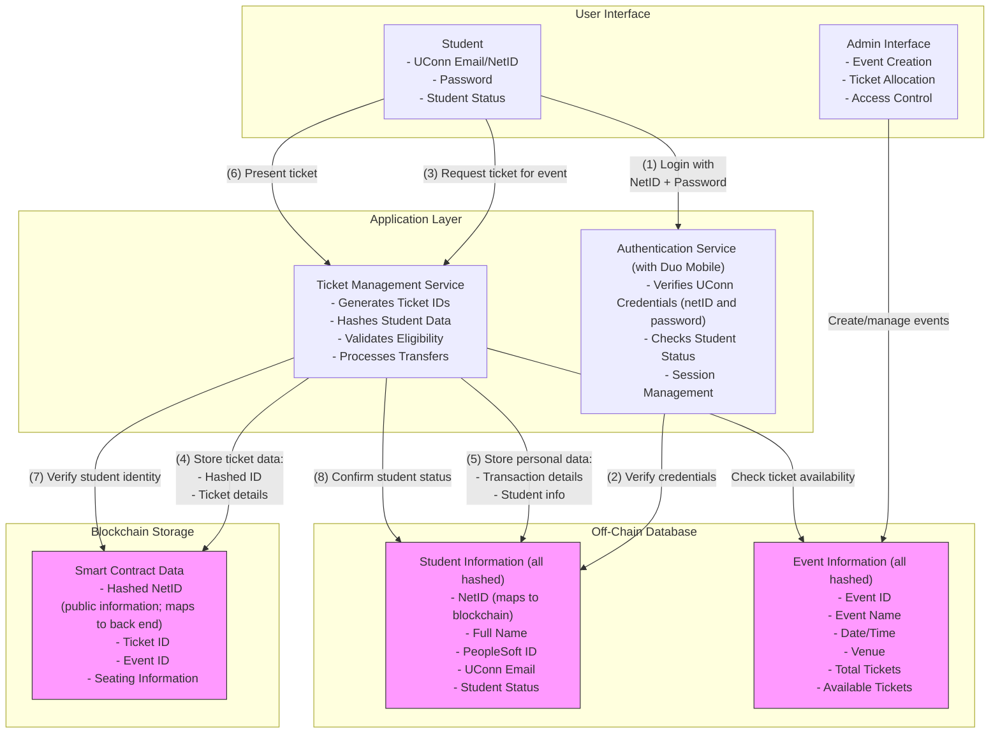

<!-- Makenzie Jones -->

```mermaid
flowchart TB
    subgraph UI ["User Interface"]
        Student["Student
        - UConn Email/NetID
        - Password
        - Student Status"]
        AdminUI["Admin Interface
        - Event Creation
        - Ticket Allocation
        - Access Control"]
    end

    subgraph Processing ["Application Layer"]
        Auth["Authentication Service (with Duo Mobile)
        - Verifies UConn Credentials (netID and password)
        - Checks Student Status
        - Session Management"]
        
        TicketService["Ticket Management Service
        - Generates Ticket IDs
        - Hashes Student Data
        - Validates Eligibility
        - Processes Transfers"]
    end

    subgraph BlockchainStorage ["Blockchain Storage"]
        SmartContract["Smart Contract Data
        - Hashed NetID (public information; maps to back end)
        - Ticket ID
        - Event ID
        - Seating Information"]
    end

    subgraph Database ["Off-Chain Database"]
        StudentData["Student Information (all hashed)
        - NetID (maps to blockchain)
        - Full Name
        - PeopleSoft ID
        - UConn Email
        - Student Status"]
        
        EventData["Event Information (all hashed)
        - Event ID
        - Event Name
        - Date/Time
        - Venue
        - Total Tickets
        - Available Tickets"]
    end

    %% Student flows
    Student -->|"(1) Login with 
    NetID + Password"| Auth
    Auth -->|"(2) Verify credentials"| StudentData
    Student -->|"(3) Request ticket for event"| TicketService
    
    %% Ticket processing
    TicketService -->|"(4) Store ticket data:
    - Hashed ID
    - Ticket details"| SmartContract
    
    TicketService -->|"(5) Store personal data:
    - Transaction details
    - Student info"| StudentData
    
    %% Event data flow
    AdminUI -->|"Create/manage events"| EventData
    TicketService -->|"Check ticket availability"| EventData
    
    %% Verification flow
    Student -->|"(6) Present ticket"| TicketService
    TicketService -->|"(7) Verify student identity"| SmartContract
    TicketService -->|"(8) Confirm student status"| StudentData

    classDef storage fill:#f9f,stroke:#333
    class SmartContract,StudentData,EventData storage
```